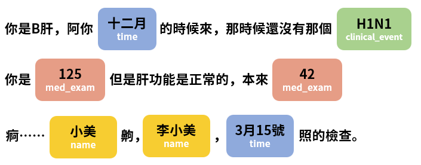
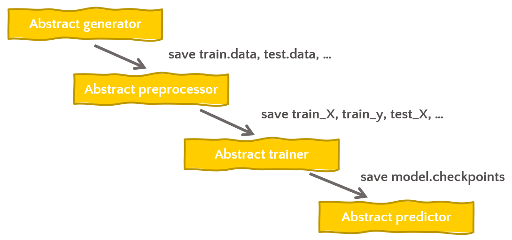
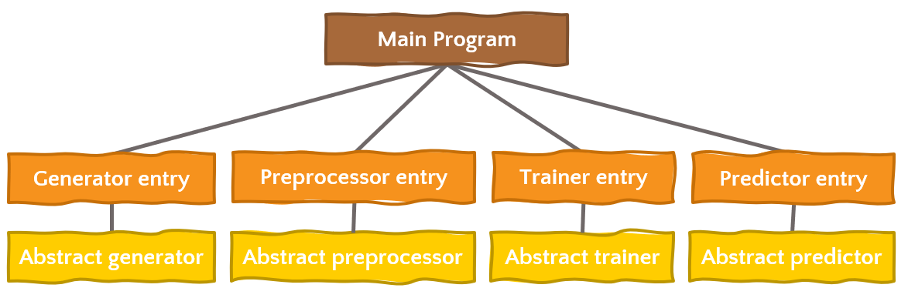

<!--
*** Thanks for checking out the AICUP-Deidentification-of-Medical-Data. If you have a suggestion
*** that would make this better, please fork the repo and create a pull request
*** or simply open an issue with the tag "enhancement".
*** Thanks again! Now go create something AMAZING! :D
***
*** To avoid retyping too much info. Do a search and replace for the following:
*** github_username (that is "windsuzu"), repo_name (that is "AICUP-Deidentification-of-Medical-Data"), project_title, project_description
-->

<!-- [![Issues][issues-shield]][issues-url] -->
[![Contributors][contributors-shield]][contributors-url]
[![MIT License][license-shield]][license-url]
[![PR Welcome][pr-welcome-shield]](#contributing)
[![Author][author-shield]][author-url]
[![LinkedIn][linkedin-shield]][linkedin-url]

<!-- PROJECT LOGO -->
 

  

  <h3 align="center">AICUP  Deidentification-of-Medical-Data</h3>

  

    AICUP  醫病資料去識別化
     
    <a href="https://github.com/windsuzu/AICUP-Deidentification-of-Medical-Data">View Demo</a>
    ·
    <a href="https://github.com/windsuzu/AICUP-Deidentification-of-Medical-Data/issues">Report Bug</a>
    ·
    <a href="https://github.com/windsuzu/AICUP-Deidentification-of-Medical-Data/issues">Request Feature</a>
  

Table of Contents

* [About](#about)
* [Getting Started](#getting-started)
* [Dataset and Baseline](#dataset-and-baseline)
  * [Baseline Source Code](#baseline-source-code)
* [Design Pattern](#design-pattern)
  * [Abstract Classes](#abstract-classes)
  * [Main](#main)
* [Contributing](#contributing)
* [License](#license)
* [Contact](#contact)
* [Acknowledgements](#acknowledgements)

---

<!-- ABOUT THE PROJECT -->
## About

<table>
<tr>
<td>

這個專案來自 [AICUP 競賽 - 醫病資料去識別化](https://aidea-web.tw/topic/d84fabf5-9adf-4e1d-808e-91fbd4e03e6d)，該競賽提供了從成功大學醫院收集的臨床對話和相關訪談的文字內容。其中，文本的隱私內容和命名實體都是由人工標註的。 F1-Score 將被用來評估測試數據集上預測的正確性。 簡而言之，這個競賽就是中文的 NER (named-entity-recognition) 任務，我們必須在文字中識別出 18 種命名實體。 我們不只想要提升任務的表現，還想藉由該任務學習應用 design pattern 於一個 AI 專案。

The competition provides information on clinical conversations and related interviews collected from the NCKU Hospital. The private contents and named entities of the text data are marked manually. The F1-Score will be used to evaluate the correctness of predictions on the test dataset. In short, this competition is the Chinese NER (named-entity-recognition) task, where we must identify 18 types of named entities in text. We not only want to improve the performance of the task, but we also want to use the task to learn to apply the design pattern to an AI project.

Built With

 

* Python 3
* PyTorch
* Transformers
* Tensorflow 2
* Jupyter Notebook
* absl-py

</td>
</tr>
</table>

---

## Getting Started

* [Dataset and Baseline](#dataset-and-baseline) 查看競賽的基礎介紹與程式碼
* [Design Pattern](#design-pattern) 查看整個專案的架構介紹
* [Motivation](docs/motivation.pdf) 查看專案動機簡報
* [Report](docs/report.pdf) 查看專案成果簡報

---

## Dataset and Baseline

* [Dataset Information](docs/dataset.md)
* [Baseline Implementation](docs/baseline.md)

### Baseline Source Code

* [Baseline](program/machine_learning/crf_baseline.py)
* [Exploratory Data Analysis](program/machine_learning/eda.py)

---

## Design Pattern

我們將不同 notebook 都切成四個部分: `data generator`, `data preprocessor`, `trainer`, `predictor`，並以這四個為基礎分別建立他們的 `abstract class`。最終在一個終端控制的 `main notebook` 使用 `absl.flags` 來操控所有的類別。

### Abstract Classes

Illustration

| data generator                                              | data preprocessor                                              | trainer                                                  | predictor                                                  |
| ----------------------------------------------------------- | -------------------------------------------------------------- | -------------------------------------------------------- | ---------------------------------------------------------- |
| [source code](program/abstracts/abstract_data_generator.py) | [source code](program/abstracts/abstract_data_preprocessor.py) | [source code](program/abstracts/abstract_ner_trainer.py) | [source code](program/abstracts/abstract_ner_predictor.py) |

### Main

Illustration

| main                                   | data generator                                | data preprocessor                                | trainer                                    | predictor                                    |
| -------------------------------------- | --------------------------------------------- | ------------------------------------------------ | ------------------------------------------ | -------------------------------------------- |
| [source code](program/main/main.ipynb) | [source code](program/main/data_generator.py) | [source code](program/main/data_preprocessor.py) | [source code](program/main/ner_trainer.py) | [source code](program/main/ner_predictor.py) |

<!-- Main Notebook -->
<!-- Abstract -->
<!-- Entity -->
<!-- Tasks -->

---

## Contributing

Contributions are what make the open source community such an amazing place to be learn, inspire, and create. Any contributions you make are **greatly appreciated**.

1. Fork the Project
2. Create your Feature Branch (`git checkout -b feature/AmazingFeature`)
3. Commit your Changes (`git commit -m 'Add some AmazingFeature'`)
4. Push to the Branch (`git push origin feature/AmazingFeature`)
5. Open a Pull Request

## License

Distributed under the MIT License. See [LICENSE](https://github.com/windsuzu/AICUP-Deidentification-of-Medical-Data/blob/main/LICENSE) for more information.

## Contact

Reach out to the maintainer at one of the following places:

* [GitHub discussions](https://github.com/windsuzu/AICUP-Deidentification-of-Medical-Data/discussions)
* The email which is located [in GitHub profile](https://github.com/windsuzu)

## Acknowledgements

* [人工智慧共創平台](https://aidea-web.tw)

[contributors-shield]: https://img.shields.io/github/contributors/windsuzu/AICUP-Deidentification-of-Medical-Data.svg?style=for-the-badge
[contributors-url]: https://github.com/windsuzu/AICUP-Deidentification-of-Medical-Data/graphs/contributors
[issues-shield]: https://img.shields.io/github/issues/windsuzu/AICUP-Deidentification-of-Medical-Data.svg?style=for-the-badge
[issues-url]: https://github.com/windsuzu/AICUP-Deidentification-of-Medical-Data/issues
[license-shield]: https://img.shields.io/github/license/windsuzu/AICUP-Deidentification-of-Medical-Data.svg?style=for-the-badge&label=license
[license-url]: https://github.com/windsuzu/AICUP-Deidentification-of-Medical-Data/blob/main/LICENSE.txt
[linkedin-shield]: https://img.shields.io/badge/-LinkedIn-black.svg?style=for-the-badge&logo=linkedin&colorB=555
[linkedin-url]: https://linkedin.com/in/windsuzu
[pr-welcome-shield]: https://shields.io/badge/PRs-Welcome-ff69b4?style=for-the-badge
[author-shield]: https://shields.io/badge/Made_with_%E2%9D%A4_by-windsuzu-F4A92F?style=for-the-badge
[author-url]: https://github.com/windsuzu
